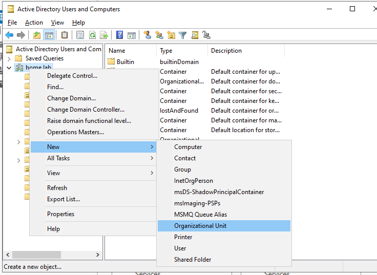
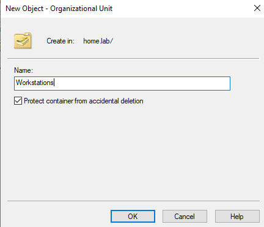
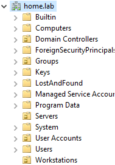
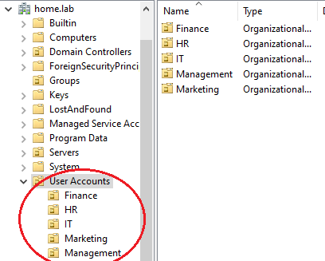
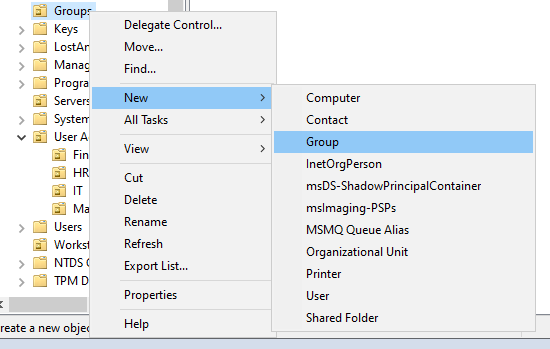
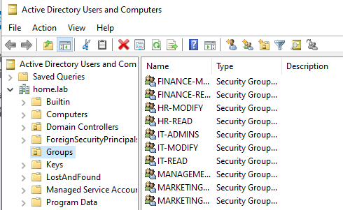

# Creating OUs and Security Groups

## Intro 
Now that we have our client joined to our `home.lab` domain, the goal of this section is to start building our mock-enterprise network. To do this, we will tune our AD organizational structure with helpful Organizational Units (OUs) and create appropriate security groups to represent domain user departments and roles.

## Purpose
There are several reasons for using OUs and security groups within our domain:
- OUs provide a structured way to organize domain objects according to their organizational role, while also allowing us to link and apply Group Policies and other administrative controls
- Security groups allow us to organize users according to their responsibilities and access requirements, which provides a foundation for implementing role-based access and least privilege later in the lab
- Separating the organizational structure of the domain from its security groups allows us to manage policies and access independently, providing greater flexibility as the environment grows  

A well-structured OU and security group foundation provides effective domain management, policy enforcement, and access control.
  
 

## Implementation + Results

### Step 1 - Designing the AD Organizational Structure
Before creating our users and groups, we first need to establish how objects will be organized within the domain. Active Directory provides several default containers when a domain is created, including the Users and Computers containers. Although these containers are functional, we will create our own Organizational Units (OUs) to provide a more structured environment and allow us to apply Group Policy and administrative controls to specific portions of the domain.

Unlike the default Users and Computers containers, OUs can be used as targets for Group Policy and provide a more flexible organizational structure. For this reason, we will create dedicated OUs rather than keeping our users and computers in the default containers.

The OUs we will initially be creating are: `Workstations`,  `User Accounts`, and `Groups`. Workstations will hold any work device that joins the domain, such as our Windows 11 Client PC, User Accounts will hold domain users, and Groups will hold any security groups we create for this domain.

#### Visual Example of Creating the Workstation OU
*Creating a new Organizational Unit*  

*Naming the OU: `Workstations`*  

Our OUs created...  

### Step 2 - Analysis of our Enterprise Network 
Before proceeding any further, we must first identify the users we have to add to the domain along with the general organizational structure of the enterprise. This will help us create appropriate OUs for our user accounts and determine what security groups they should be added to. This enterprise has an `IT`, `Finance`, `HR`, and `Marketing` department. We have `9` employees and `1` senior manager to add to this enterprise domain. 

### Senior Management (oversees all departments)
- **Ally M.** : *Senior Manager*

#### IT department
- **Rachel W.** : *IT Department Head*
- **Haneen A.** : *IT Administrator*
- **Amir J.** : *IT Associate*

#### Finance department 
- **Devon D.** : *Finance Department Head*
- **Omar M.** : *Finance Associate*
- **Emily H.** : *Finance Associate*

#### Marketing department 
- **Jess K.** : *Marketing Department Head*
- **John S.** : *Marketing Associate*

#### HR department 
- **Sophia P.** : *HR Department Head*

We will now create additional OUs within `User Accounts` to organize these users according to their organizational role. These OUs provide a structured way to organize users and allow policies and administrative controls to be applied to specific groups of users based on their organizational placement. For example, a policy linked to the IT OU can apply specifically to users within the IT department without affecting users in other departments.

In addition to the OUs, we will create security groups that correspond to the access requirements of different users. Although OUs and security groups are both used to organize users, they serve different purposes. OUs are primarily used to organize objects and establish a scope for management and Group Policy, whereas security groups can be used to assign permissions and control access to resources. In other words, a user's OU describes where they belong within the organization's structure, while their group memberships can determine what level of access they have to certain resources.

### Step 3 - Creating OUs

We will create the necessary Organizational Units (OUs) for this domain: `Management`, `IT`, `Finance`, `Marketing`, and `HR`. 

### Step 4 - Creating Security Groups 

Looking at the organization of the enterprise from earlier, we see that we have a senior manager, different department heads and associates, and an IT administrator. Naturally, these roles have different responsibilities. We will create the following security groups to represent the departments and roles within our enterprise and provide a foundation for future access control: 
- FINANCE-READ
- FINANCE-MODIFY
- HR-READ
- HR-MODIFY
- MARKETING-READ
- MARKETING-MODIFY
- IT-READ
- IT-MODIFY
- IT-ADMINS
- MANAGEMENT-ACCESS

#### Example of implementation

*Devon D. --> Finance Department Head*   
*OU: Finance*  
*Security groups: FINANCE-MODIFY*

whereas...

*Emily H. --> Finance Associate*  
*OU: Finance*  
*Security groups: FINANCE-READ*

Both Devon and Emily will be affected by GPOs directed towards the Finance OU. Their allocation in different security groups will allow us to assign different levels of access to Finance resources later in the lab. For example, Devon's membership in FINANCE-MODIFY will eventually allow him to modify Finance resources, while Emily's membership in FINANCE-READ will restrict her to read access.

*It should also be noted that there is a completely separate group for IT administrators, as privileged access should only be available to users who require it. Furthermore, administrative accounts should be kept separate from everyday work accounts where possible, even within the IT department itself.*

#### Creating Groups Process and Result

When creating security groups, we follow a similar process to creating OUs.  

We create all of our security groups within our `Groups` OU.  
  

## Conclusion 

With our OU and security group configurations successfully established, we can move on to creating our domain user accounts and placing them in their designated locations within the domain.

