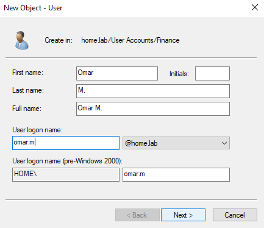
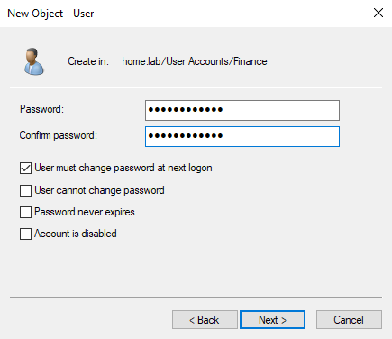
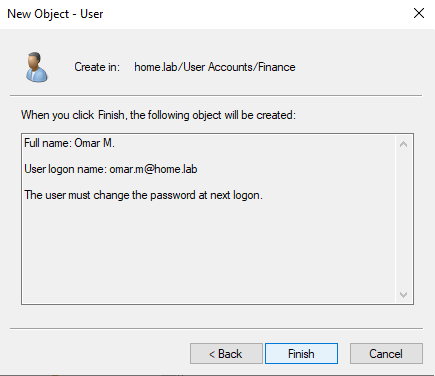
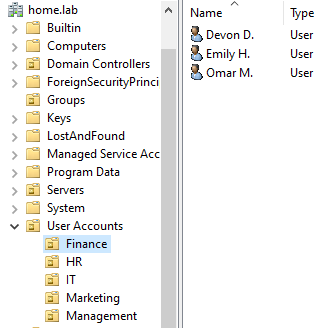
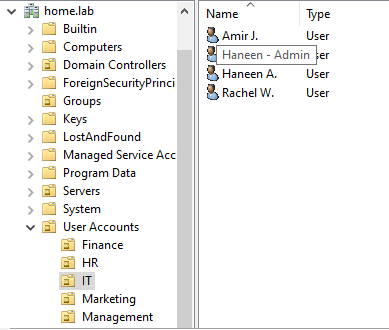

# Creating and Organizing Domain Users 

## Intro 
Now that we have our OUs and security groups created, it is time to start creating and organizing domain users within them.

## Purpose
The reason we create unique domain user accounts per individual and organize them with OUs and security groups:
- Having separate domain user accounts allows us to centrally manage and log the activity of each account
- Allows us to create an organizational structure within our Active Directory to simplify and implement policies and rules
- Helps us implement access control rules per user or role to successfully implement least privilege

In other words, the creation and organization of domain users allows us to centrally manage them from our domain controller, helping to ensure efficiency and security (if implemented correctly).

## Implementation + Results

Please note that since the last section (ous-&-groups) went into depth with explanations, this section will mostly just be concise implementations and results

### Step 1 - Create Domain Users Within Their Appropriate OU

As shown before, we have created a handful of OUs under the `User Accounts` OU to organize all of our users. Instead of creating domain users and then moving them to their dedicated OU, we can simply create them under their OU from the start. We simply navigate to our `Active Directory Users and Computers`, go within the appropriate OU, and create a new user.

*Here, we create Omar, a Finance Associate:*

*We give Omar a temporary password he will use to log in to his account, we make it a requirement that he changes his password upon initial login. It is best practice in IT security that the temporary password given should always be an adequate length and randomly generated.*

*Our finance domain users created...*

*As mentioned in the last section, Haneen, the IT administrator, is given both a personal account and an admin account. This is applies a **Privileged Access Management (PAM)** best practice called **Privileged Account Separation**. This ensures that her everyday work account does not have unnecessary elevated privileges or elevated access.*

### Step 2 - Move Them to the Appropriate Security Group(s)
Here are the security group(s) each user will be added to based on their role...

- **Ally M.** : *Senior Manager* --> MANAGEMENT-ACCESS
- **Rachel W.** : *IT Department Head* --> IT-MODIFY
- **Haneen A.** : *IT Administrator* --> IT-MODIFY (on personal account) & IT-ADMINS (on admin account)
- **Amir J.** : *IT Associate* --> IT-READ
- **Devon D.** : *Finance Department Head* --> FINANCE-MODIFY
- **Omar M.** : *Finance Associate* --> FINANCE-READ
- **Emily H.** : *Finance Associate* --> FINANCE-READ
- **Jess K.** : *Marketing Department Head* --> MARKETING-MODIFY
- **John S.** : *Marketing Associate* --> MARKETING-READ
- **Sophia P.** : *HR Department Head* --> HR-MODIFY

*Note that the Senior Manager oversees all departments PASSIVELY by default. Because of this, the `MANAGEMENT-ACCESS` security group will only grant her read permissions for all departments rather than modify permissions by default. The reason I didn't assign her to four separate read-permission groups is that, while manageable at the current scale, maintaining multiple individual group memberships can become difficult to track as the business grows. Instead, all management-level access is consolidated under `MANAGEMENT-ACCESS` to simplify permission management and improve scalability.*

We then install both the AD DS and DNS server roles. The remaining settings can be left at their defaults.

Finally, we can promote our server to domain controller.

We are then prompted with the deployment configuration. Since we are building this primary domain controller from scratch, we select **Add a new forest**. For the root domain name, to keep it simple, I chose `home.lab`. We are then prompted to choose a Directory Services Restore Mode (DSRM) password, which we can use if we ever need to boot the server into recovery mode. A secure password was chosen accordingly for this step. If all prerequisites are met, the installation should occur successfully. We can check that the domain has been created successfully on our DNS Manager. 

We can also run a health check using the command **dcdiag** on the Command Prompt to ensure everything is working. 

### Step 3 - Verify That Domain Users can log on

## Conclusion

And that brings us to the end of this section. 

As of now, our server:
- Has had the AD DS and DNS server roles installed
- Has been promoted to a domain controller
- Has created the `home.lab` domain

Next, we tackle our Windows Client VM!
