# Creating and Implementing GPOs

## Intro 
Now that we have our domain users created organized within our OUs, we can now create and implement our Group Policy Objects (GPOs). In this section we will implement 4 GPOs. The first will be a domain-wide password policy. The second will be a workstation policy that provides device-level Windows Firewall Security. The third will be a Removable Storage Restriction Policy applied at the workstation-level to help prevent data exfiltration of sensitive content. And the last will be a local IT administration policy applied to our not-yet elevated IT Administrator account.

## Purpose
The reason we implement GPOs within a domain are plentiful, here are the reasons relevant to this lab:
- GPOs allow us to establish domain-wide policies that impact all domain users, a very important example being **Password Policies**, which help to enforce secure password requirements
- They can also be more granular, allowing us to create security and configuration policies for overarching OUs such as `Workstations` or `User Accounts`
- GPOs can be quite flexible, allowing us to implement configurations to specific security groups, we will see an example of this in our IT Admin Policy.

In other words, GPOs let us centrally enforce security and configuration policies across the domain while also allowing specific policies to be applied to individual OUs. This helps maintain consistent security standards while adapting policies to the needs of different users and devices.

## Implementation + Results

### GPO #1 - Domain-Wide Password Policies and Account Lockout

#### Objective
This GPO allows us to maintain secure domain workstations and user accounts by requiring strong passwords and implementing account lockout policies. These security policies will help prevent unauthorized access to our user accounts or Windows 11 workstation.

#### Configuration 

Both the Password Policy and Account Lockout Policy are configured within the `Default Domain Policy`, which is linked to the domain root instead of a specific OU. This allows the configured policies to be enforced domain-wide, affecting any devices and users within the domain. 

*Navigating through the Default Domain Policy to Password and Account Lockout Policy:*

*Enforcing best practice password policies:*

These password policies and respective values are chosen with the following reasoning: 
- a strong password history of 24 passwords so users do not repeat their 'favourite' few passwords
- a maximum password age of 90 days (3 months), ensuring that users do not use the same password for prolonged periods of time
- a minimum password age of 1 day so that users can not cycle through many passwords in one sitting to game the password history requirement
- a minimum password length of 12 characters (this length is still secure in modern times when paired with the next enforcement)
- ensuring password must meet complexity requirements which forces users to use characters from uppercase letters, lowercase letters, numbers, and special characters -- passwords also cannot contain the user's account name or significant portions of their full name

*Enforcing best practice account lockout policies:*

It is best practice in stricter enterprise environments to issue an account lockout after 5 failed login attempts. We also set the account lockout duration to 15 minutes to prevent unauthroized users from gaining access to accounts when the authorized user might be away from a logged-in workstation for a prolonged period of time.

#### Verification

We can now check that our GPO is correctly enforced. 

Opening the command prompt on the Windows Server, we use the command `net accounts`. The command `net accounts` in this case will display the domain password and account policy settings configured on a Windows system.

We can also verify this from the Windows client with the commands `gpupdate /force` and `gpresult /r`. The former forces the client computer to immediately reapply all applicable Group Policy settings, and the latter displays said group policies. With the screenshot below, we can see that the Default Domain Policy has been successfully applied to the Computer Settings of our Windows client.

Lastly, to see this GPO in action, we attempt to change our password on one of the user accounts. The desired password is less than 12 characters long, and does not have an adequate mix of types of characters.

The user's password change is denied and they are prompted to meet the password length and complexity requirements.

This example demonstrates the Account Lockout Threshold which we set to 5. After Sophia inputs the incorrect password more than 5 times, she is temporarily locked out of her account.

  
  

### GPO #2 - Workstation Security Policy

#### Objective

This GPO allows us to implement a Windows Firewall Policy across all workstations in the domain by being linked to the `Workstations` OU. Goal: our Windows 11 client PC within the `Workstations` OU should have **Windows Defender Firewall** enabled.

#### Configuration 

Upon opening `Group Policy Management`, we navigate to our Workstation OU. We create and link a new GPO within this domain, naming it `WORKSTATION-SECURITY`.

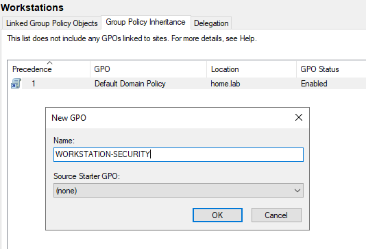

Within our new GPO, we navigate to **Windows Defender Firewall with Advanced Security** properties. Under Domain Profile we enable the Firewall state to 'On'. 

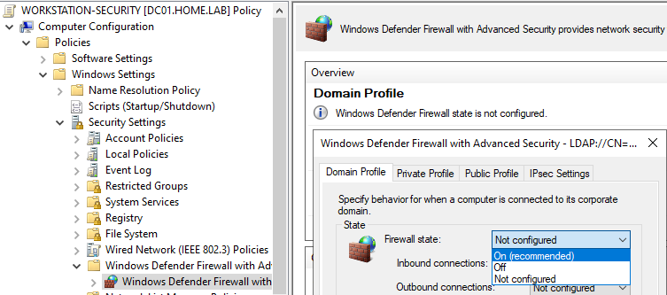

#### Verification

On the client, from an Administrator CMD, we run the previous commands `gpupdate /force` and `gpresult /r`. We see `WORKSTATION-SECURITY` under **Applied Group Policy Objects**.

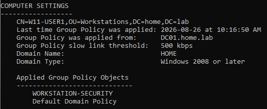

We can also verify the firewall itself on the client with the command `netsh advfirewall show allprofiles`. 

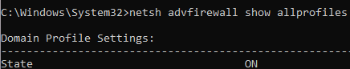

### GPO #3 - Removable Storage Restriction Policy

#### Objective

This GPO will help prevent unauthorized data exfiltration through removable storage devices (such as USBs or other removable storage drives) on devices within the `Workstations` OU. Data exfiltration through removable storage devices is a common security concern, especially when there is sensitive data on the line. In this enterprise, this especially applies to the Finance and HR departments. The former carries sensitive financial records of the company and it's clients and the latter carrying sensitive employee and possibly client PII.

For these reasons, this organization wants to instill a policy stating: **Domain workstations do not permit removable-storage write access by default**. We focus on write access specifically because this will prevent users from writing data to removable storage devices, while still allowing them to read data from storage devices if necessary. This will be especially helpful when demonstrating the successful implementation of this GPO in our lab.

#### Configuration 

First, we will observe our Windows 11 client's current behaviour regarding removable storage devices. For the purpose of this lab, a virtual USB disk was created and attached to our Windows 11 VM to act as a legitimate USB drive. If you're interested in the process of how that was configured, you can go [here](https://github.com/haneen-al/cybersecurity-home-lab/blob/main/02-windows-client/2.0-windows-client-overview.md#creating-a-virtual-usb-on-windows-11-vm) before jumping back into this part of the lab.

On our Windows client, we log on as a domain user. Our virtual USB drive is connected to our VM and can be viewed from our File Explorer. 

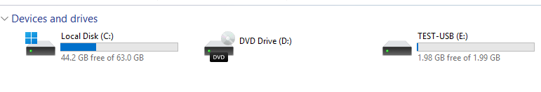

We are currently able to create and write to files on this USB.

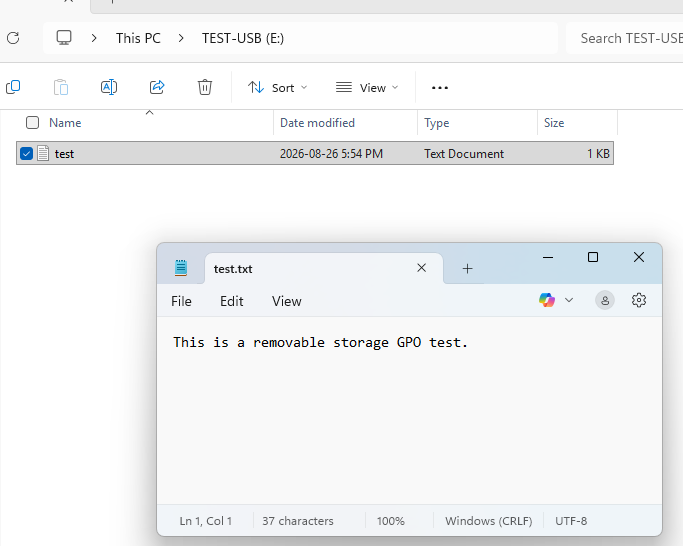

For our desired security goals, allowing domain users to write to removable storage devices such as the one above must be restricted. 

We now go to our Windows Server to configure the desired policy. We create our GPO under the `Workstations` OU and name it `REMOVABLE-STORAGE-RESTRICTION`. 

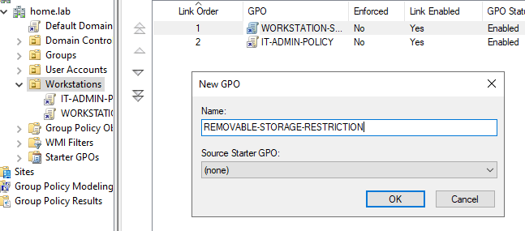

We then navigate within this GPO to 'Removable Storage Access' under Computer Configuration. 

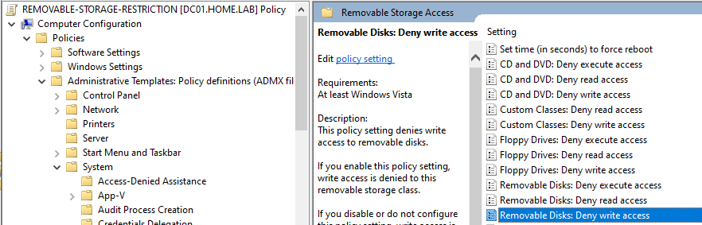

Enable 'Removable Disks: Deny Write Access'.

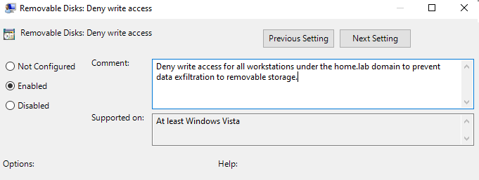

#### Verification

To verify the application of this GPO, we update the client workstation with the command `gpupdate /force` and view the result with `gpresult /r`. 

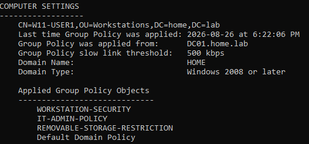

We can see that the `REMOVABLE-STORAGE-RESTRICTION` policy has been successfully applied to the Computer Settings.

We can also verify our GPO implementation by attempting to write to the USB drive. 

Here, we are restricted from creating a new file within this USB.

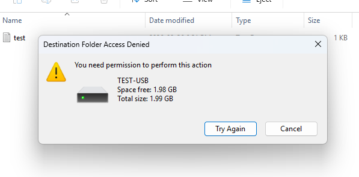

And here, we are restricted from modifying the contents of the already existing .txt file on the USB.

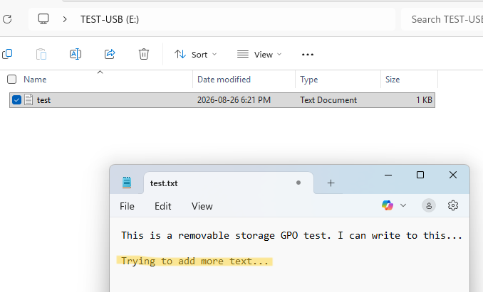
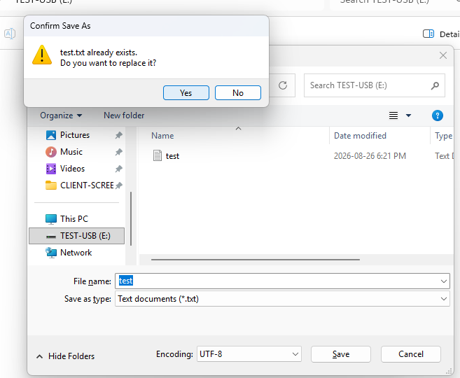
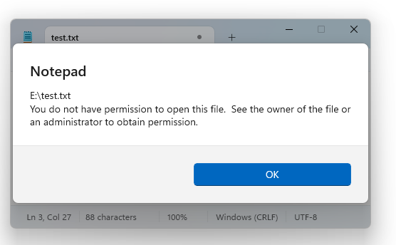

We can also check that the GPO is applied device-wide by logging in to another domain user account and attempting the same actions as above. Switching from `haneen.admin` to `sophia.p` account:

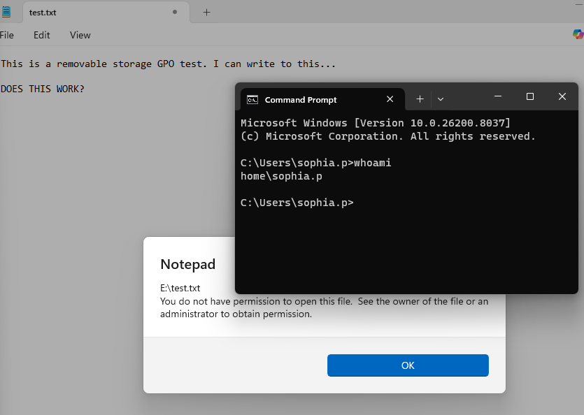

### GPO #4 - IT Admin Policy

#### Objective

This GPO configures elevated administrative privileges on domain workstations for designated IT administrator accounts. This will demonstrate **least privilege** and **separation of administrative and everyday accounts**. As of right now, no domain user is a local administrator, including Haneen's Admin account. 

The goal is to have Haneen's admin account receive local admin privileges, while her personal account and the other two IT accounts (Amir and Rachel) continue to use standard accounts.

To accomplish this, this GPO will be linked to the `Workstations` OU and the `IT-ADMINS` security group, which only Haneen's administrative account is a part of.

>[!NOTE]
>*It should be noted that the GPO is linked to the `Workstations` OU instead of the `IT` OU because we're configuring the computer's local Administrators group which is a **Computer Configuration** setting. The IT-ADMINS group determines which users receive the administrative privilege through that local group membership.*

#### Configuration 

The first step is to create our GPO `IT-ADMIN-POLICY` and link it to our `Workstations` OU. 

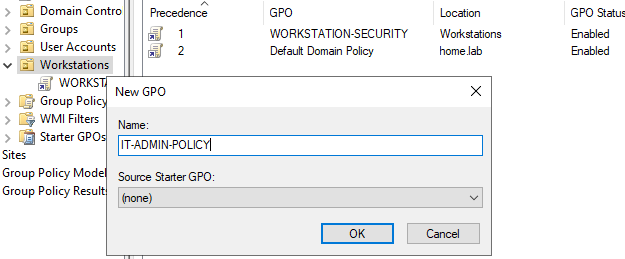

Now to actually give Haneen's Admin account local administrator privileges, we navigate to `Local Users and Groups` in our GPO. We create a new local group called `Administrators` and add our security group `IT-ADMINS`. This effectively makes Haneen's Administrative account a local administrator.

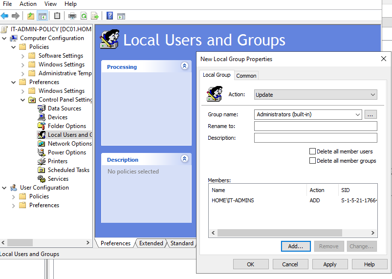

#### Verification

We can check that the above configurations have been implemented on our Windows server. 

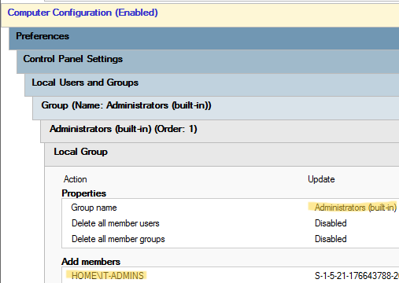

We must also ensure that Haneen's admin account is the only account in the security group `IT-ADMINS`.

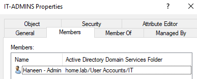

Now to verify from the client PC...

After opening an Admin CMD on the Windows client, running `gpupdate /force`, and restarting the computer, we should be able to log into Haneen's Admin account to verify configurations. 

On Haneen's Administrator account, we open CMD and run the command, `whoami /groups` which reflects that this account now works as a local admin account. 

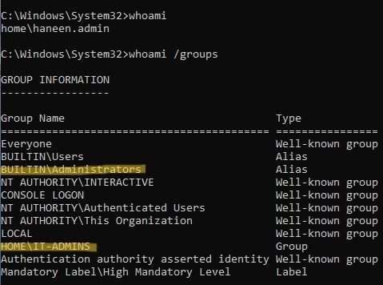

We can also run CMD as an Administrator without being prompted for additional administrative credentials. Previously, we had to enter the Windows Server administrator account credentials to access an elevated CMD on the client PC. Now, the account can directly access an elevated CMD using its assigned administrative privileges.

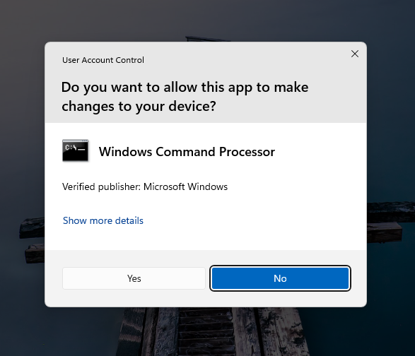

As opposed to a standard user account where when we try to access an elevated CMD, we are met with a request for administrative credentials: 

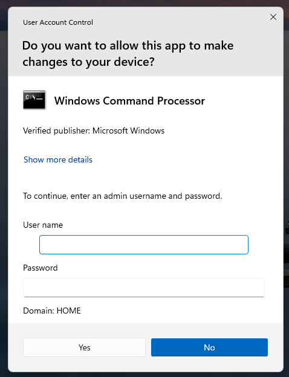

## Conclusion

That brings us to the end of this section. 

As of now have implented:
- A domain-wide Password Policy and Account Lockout Policy GPO (linked to domain root)
- A workstation-wide Windows Firewall Policy GPO (linked to `Workstations` OU)
- A workstation-wide Removable Storage Restriction Policy (linked to `Workstations` OU)
- A workstation-wide IT Admin Policy (linked to `Workstations` OU and applied to `IT-ADMIN` security group)

No GPOs thus far have been linked directly to specific department OUs because there are currently no necessary department-specific User Settings to enforce within this enterprise network. Rather than creating arbitrary policies simply to use each department OU, I have chosen to focus on implementing concrete, relevant security controls that reflect realistic enterprise requirements, even when those GPOs are best applied at the workstation or domain level.

The department OUs still provide valuable organizational structure and establish a clear scope for applying department-specific GPOs if necessary in the future.

Next, we move on to file sharing and access control rules!
