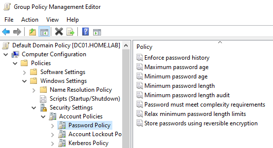
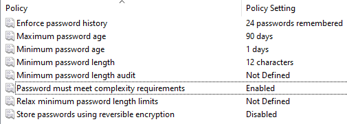
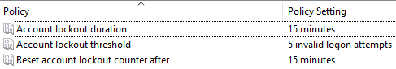
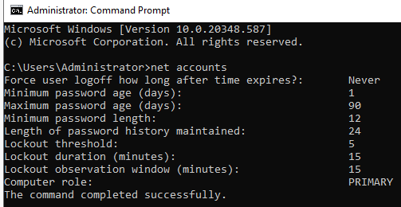
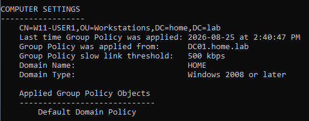
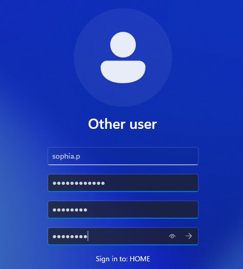
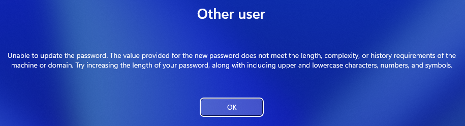
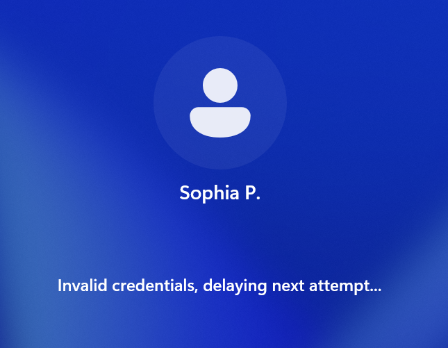
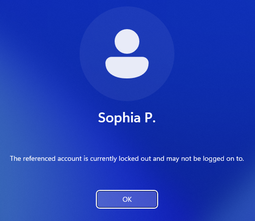
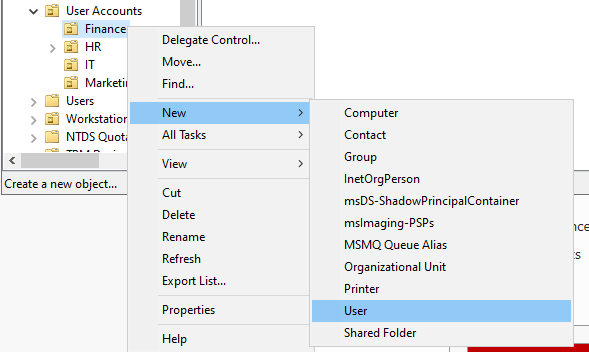

# Creating and Implementing GPOs

## Intro 
Now that we have our domain users created organized within our OUs, we can now create and implement our Group Policy Objects (GPOs). In this section we will implement 4 GPOs. The first will be a domain-wide password policy. The second will be a workstation policy that provides device-level security. And the last two will be department-specific policies for the IT and Finance departments.

## Purpose
The reason we implement GPOs within a domain are plentiful, here are the reasons relevant to this lab:
- GPOs allow us to establish domain-wide policies that impact all domain users, a very important example being **Password Policies**, which help to enforce secure password requirements
- They can also be more granular, allowing us to create security and configuration policies for overarching OUs such as `Workstations` or `User Accounts`
- Lastly, they can help us implement policies specific to a department such as our `IT` OU, without affecting users in other department OUs

In other words, GPOs let us centrally enforce security and configuration policies across the domain while also allowing specific policies to be applied to individual OUs. This helps maintain consistent security standards while adapting policies to the needs of different users and devices.

## Implementation + Results

### GPO #1 - Domain-Wide Password Policies and Account Lockout

#### Objective
This GPO allows us to maintain secure domain workstations and user accounts by requiring strong passwords and implementing account lockout policies. These security policies will help prevent unauthorized access to our user accounts or Windows 11 workstation.

#### Configuration 

Both the Password Policy and Account Lockout Policy are configured within the `Default Domain Policy`, which is linked to the domain root instead of a specific OU. This allows the configured policies to be enforced domain-wide, affecting any devices and users within the domain. 

*Navigating through the Default Domain Policy to Password and Account Lockout Policy:*

*Enforcing best practice password policies:*

These password policies and respective values are chosen with the following reasoning: 
- a strong password history of 24 passwords so users do not repeat their 'favourite' few passwords
- a maximum password age of 90 days (3 months), ensuring that users do not use the same password for prolonged periods of time
- a minimum password age of 1 day so that users can not cycle through many passwords in one sitting to game the password history requirement
- a minimum password length of 12 characters (this length is still secure in modern times when paired with the next enforcement)
- ensuring password must meet complexity requirements which forces users to use characters from uppercase letters, lowercase letters, numbers, and special characters -- passwords also cannot contain the user's account name or significant portions of their full name

*Enforcing best practice account lockout policies:*

It is best practice in stricter enterprise environments to issue an account lockout after 5 failed login attempts. We also set the account lockout duration to 15 minutes to prevent unauthroized users from gaining access to accounts when the authorized user might be away from a logged-in workstation for a prolonged period of time.

#### Verification

We can now check that our GPO is correctly enforced. 

### GPO #2 - Workstation Security Policy

#### Objective

#### Configuration 

#### Verification

### GPO #3 - IT User Security Policy

#### Objective

#### Configuration 

#### Verification

### GPO #4 - Finance User Security Policy

#### Objective

#### Configuration 

#### Verification

## Conclusion

That brings us to the end of this section. 

As of now have implented:
- ...

Next, we move on to file sharing and access controls.
