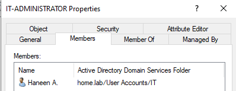
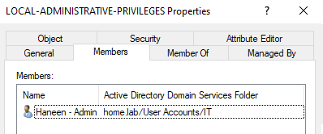
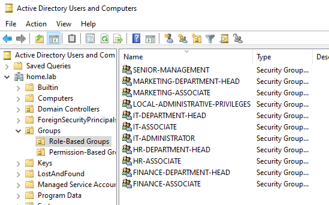
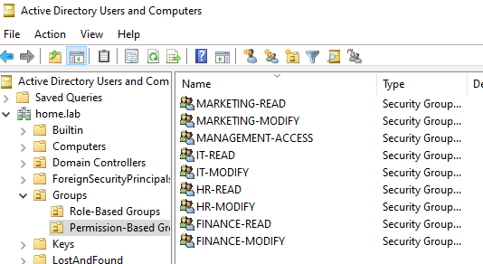
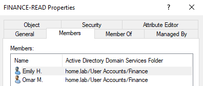
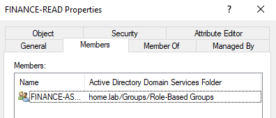
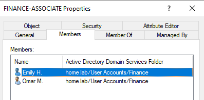
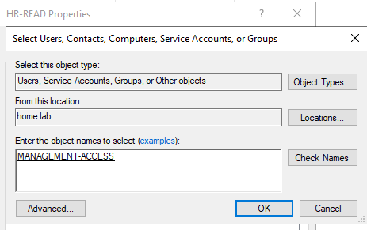
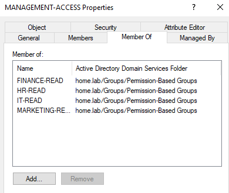

# File Sharing and Role-Based Access Control

## Intro 

Now that we have implemented our security-based GPOs, we can move on to configuring an appropriate file sharing and access control structure. For this section of the lab I will demonstrate a security-group-based access control model using Role-Based Access Control (RBAC), and demonstrate the difference between Share and NTFS permissions, and when to appropriately appy them. I will need to restructure the security-group memberships of our users, as I want to implement RBAC. To do this, I will remove users from being directly linked to permission security groups (such as `FINANCE-MODIFY`), and instead link users to role-based security groups (such as `FINANCE-DEPARTMENT-HEADS`). This allows permissions to be assigned to roles rather than directly to individual users.

## Purpose
The reasons we implement file sharing and security-group-based RBAC:
- In an enterpise, employees need access to files that are stored centrally rather than keeping everything on individual workstations. Centralized file storage helps with centralized management, controlled access, consistency, and can facilitate auditing and monitoring when those capabilities are configured.
- Access control answers a question that file sharing does not, who should be allowed to access this resource, and what should they be allowed to do with it? Access control allows us to enforce least privilege so that users receive only the necessary files to perform their responsibilities.
- RBAC allows us to assign permissions based on roles rather than individual people. With individual permissions, it becomes difficult to keep track of what user has access to what whereas with RBAC, a user's access can be determined through the roles assigned to them rather than through a collection of individual permissions. This is especially useful in environments that are bound to scale.  

Together, these controls create a structured security architecture: sensitive data is centrally stored, access is controlled according to least privilege, users are assigned roles, and roles are granted appropriate permissions. NTFS and share permissions then enforce those access requirements at the file-server level.

## Implementation + Results

### Section 1 - Role-Based Access Control

#### Access Model 

For this section, we will need to re-shape the structure of our access-control groups. As of now, we have the following structure: 

- **Ally M.** : *Senior Manager* --> `MANAGEMENT-ACCESS`
- **Rachel W.** : *IT Department Head* --> `IT-MODIFY`
- **Haneen A.** : *IT Administrator* --> `IT-MODIFY` (on personal account) & `IT-ADMINS` (on admin account)
- **Amir J.** : *IT Associate* --> `IT-READ`
- **Devon D.** : *Finance Department Head* --> `FINANCE-MODIFY`
- **Omar M.** : *Finance Associate* --> `FINANCE-READ`
- **Emily H.** : *Finance Associate* --> `FINANCE-READ`
- **Jess K.** : *Marketing Department Head* --> `MARKETING-MODIFY`
- **John S.** : *Marketing Associate* --> `MARKETING-READ`
- **Sophia P.** : *HR Department Head* --> `HR-MODIFY`

In order to implement RBAC, we must assign users to role groups instead of permission groups: 

- **Ally M.** : *Senior Manager* --> `SENIOR-MANAGEMENT`
- **Rachel W.** : *IT Department Head* --> `IT-DEPARTMENT-HEAD`
- **Haneen A.** : *IT Administrator* --> `IT-ADMINISTRATOR` (on personal account)
- **Amir J.** : *IT Associate* --> `IT-ASSOCIATE`
- **Devon D.** : *Finance Department Head* --> `FINANCE-DEPARTMENT-HEAD`
- **Omar M.** : *Finance Associate* --> `FINANCE-ASSOCIATE`
- **Emily H.** : *Finance Associate* --> `FINANCE-ASSOCIATE`
- **Jess K.** : *Marketing Department Head* --> `MARKETING-DEPARTMENT-HEAD`
- **John S.** : *Marketing Associate* --> `MARKETING-ASSOCIATE`
- **Sophia P.** : *HR Department Head* --> `HR-DEPARTMENT-HEAD`
- For future scaling purposes, we will also create the role group `HR-ASSOCIATE`, although it is currently not required.

*Please note that the security group `IT-ADMINS` serves a different purpose from the security group `IT-ADMINISTRATOR`. The `IT-ADMINS` group was created to grant its members local administrative privileges on domain-joined workstations, while `IT-ADMINISTRATOR` is a role-based group that will be nested within permission-based groups such as `IT-MODIFY`. To prevent confusion between these two purposes, the `IT-ADMINS` group will be renamed to `LOCAL-ADMINISTRATIVE-PRIVILEGES`.**

*Haneen's administrative account is a member of `LOCAL-ADMINISTRATIVE-PRIVILEGES`, which provides local administrative privileges, and no automatic file-share/NTFS permissions. Haneen's personal account will be a member of `IT-ADMINISTRATOR`, which represents her organizational role for file-access purposes. This helps create a clear separation of duties between her administrative user account and personal user account.*

**Visual diagram of Haneen's Accounts:**  

Haneen's Admin Account 
&emsp;├── LOCAL-ADMINISTRATIVE-PRIVILEGES 
&emsp;&emsp; &emsp;     └── Local Administrators 
&emsp;&emsp;     &emsp; &emsp;   &emsp;    └── Windows 11 workstation 

Haneen's Personal Account 
&emsp;├── IT-ADMINISTRATOR 
&emsp;  &emsp; &emsp;  &emsp;  └── IT-MODIFY 
&emsp;      &emsp;   &emsp;  &emsp; &emsp; &emsp; └── IT folder 

**Visual Demonstration of Keeping Haneen's two Accounts Separate:**

From here, we can add these roles as members to our permission groups. The following mapping will be implemented:
- `SENIOR-MANAGMENT` --> `MANAGEMENT-ACCESS` (will contain all department read permissions)
- `IT-DEPARTMENT-HEAD` --> `IT-MODIFY`
- `IT-ADMINISTRATOR` --> `IT-MODIFY`
- `IT-ASSOCIATE` --> `IT-READ`
- `FINANCE-DEPARTMENT-HEAD` --> `FINANCE-MODIFY`
- `FINANCE-ASSOCIATE` --> `FINANCE-READ`
- `MARKETING-DEPARTMENT-HEAD` --> `MARKETING-MODIFY`
- `MARKETING-ASSOCIATE` --> `MARKETING-READ`
- `HR-DEPARTMENT-HEAD` --> `HR-MODIFY`
- `HR-ASSOCIATE` --> `HR-READ` 

With this access control model, users will be assigned to roles, and roles will be assigned to permissions. This way, no user is a direct member of any access-control permissions, ultimately improving the clarity and scalability of our access control model.

#### Implementing the Groups

We create our needed role-based security groups. We create two new OUs within the `Groups` OU, `Role-Based Groups` and `Permission-Based Groups`. We organize our security groups accordingly.

We add our role-based security groups as members to the appropriate permission-based security groups. We do this while removing individual users membership from permission-based security groups and assigning them membership to the appropriate role-based security groups.

*Before:*

*After:*

*Move Users Here:*

#### Management Access 

We now add our `MANAGEMENT-ACCESS` permission group as a member of each of the four departmental read groups: `IT-READ`, `HR-READ`, `MARKETING-READ`, and `FINANCE-READ`.

This structure follows the direction of how security-group membership is applied in Active Directory. Ally is a member of the role-based `SENIOR-MANAGEMENT` group, which is itself a member of `MANAGEMENT-ACCESS`. By making `MANAGEMENT-ACCESS` a member of each departmental read group, Ally's membership is effectively inherited through the chain:

**Ally → `SENIOR-MANAGEMENT` → `MANAGEMENT-ACCESS` → `IT-READ` / `HR-READ` / `MARKETING-READ` / `FINANCE-READ`**

This allows Ally to inherit read access to each department's resources without assigning her account directly to four separate permission groups. If we placed the four departmental read groups inside `MANAGEMENT-ACCESS`, we would reverse the membership direction which would cause Ally to not inherit their permissions.

Now our manager Ally, with a membership to the role group `SENIOR-MANAGER`, effectively has access to all department read permissions.

We have successfully created the structure of our RBAC system.

### Section 2 - Share Permissions vs NTFS Permissions

Before we can apply any permissions, we must first have resources to work with. We first create a central file share called `CompanyData` that resides on the Windows Server's local disk. Within this folder, we create sub-folders for each department, as well as folders for company-wide and management access. These folders are: `Company Overview`, `Management`, `IT`, `Finance`, `HR`, and `Marketing`.

PIC

We then populate each of these folders with a few mock files to provide resources for our access-control testing.

PIC

#### NTFS Permissions

Now we can configure NTFS permissions. **NTFS permissions** control which users and security groups can access files and folders on an NTFS-formatted volume, as well as what actions they are allowed to perform. These permissions can be assigned at the folder or file level and include permissions such as Read, Modify, and Full Control.

NTFS permissions are particularly important for this lab because they allow us to enforce the **least-privilege access model** established in the previous section. Rather than assigning permissions directly to individual users, we assign permissions to our permission-based security groups. Users then inherit their access through the role-based group structure.

The following NTFS permission structure will be followed:

- `CompanyData`: all domain users will have read access to the shared root directory.
- `Management`: members of `MANAGEMENT-ACCESS` will have Modify access. No other domain-user groups will be granted access to this folder.
- `IT`: members of `IT-MODIFY` will have Modify access, while members of `IT-READ` will have Read & Execute access.
- `Finance`: members of `FINANCE-MODIFY` will have Modify access, while members of `FINANCE-READ` will have Read & Execute access.
- `Marketing`: members of `MARKETING-MODIFY` will have Modify access, while members of `MARKETING-READ` will have Read & Execute access.
- `HR`: members of `HR-MODIFY` will have Modify access, while members of `HR-READ` will have Read & Execute access.

This structure allows the role-based security groups established in the previous section to determine which permission groups users belong to, while the permission groups themselves are responsible for determining access to the actual resources.

We go to a specific folder, such as our `IT` folder, and select 'Give access to specific people'. We can then add our appropriate permission groups, `IT-READ` with Read permissions and `IT-MODIFY` with Read/Write permissions to the NTFS ACL. We do not need to add `MANAGEMENT-ACCESS` here because it is already a member of `IT-READ`. This allows senior management to inherit the same read access without requiring a separate ACL entry.

PIC

*It should also be noted that Windows normally grants members of the local Administrators group administrative control over folders on the server. This provides administrators with the ability to manage the file system and recover access if permissions are incorrectly configured or an administrator needs to modify the ACL.*

We continue configuring each department folder with the appropriate permission groups.

For our `Company Overview` folder, we allow all domain users (users within the company) to have Read access, while `MANAGEMENT-ACCESS` receives Modify access. This allows all users within the domain to view general company inforation while restricting the ability to modify that information to management.

PIC

Our `Management` folder is intended for management-only information. Therefore, `MANAGEMENT-ACCESS` is granted Modify access to this folder. Other domain-user groups are not granted access.

PIC

We have now completed applying our NTFS permissions.

links: IT (file://Dc01/it)

#### Share permissions

NTFS permissions control access to the files and folders on the server itself, but because these resources will be accessed over the network, we also need to configure **SMB** share permissions.

Share permissions determine what users are allowed to do when accessing a resource through its network share.

### Section 3 - Verification and Testing

Finance Associate - Omar

OMAR -> FINANCE-READ
- Open Finance folder y
- Read a document y
- Create a document n
- Modify an existing document n
- Delete a document n

Finance Department Head - Devon

DEVON -> FINANCE-MODIFY
- Open Finance folder y
- Read documents y
- Create document y
- Modify document y
- Delete document y

Marketing Associate - John

JOHN -> MARKETING-READ
- Open Finance folder n
- Read Marketing resources y
- Modify Marketing resources n

Senior Manager - Ally

ALLY -> MANAGEMENT-ACCESS
- Read Finance y
- Read IT y
- Read Marketing y
- Read HR y
- Modify Finance n
- Modify IT n
- Modify Marketing n
- Modify HR n

## Conclusion

And that brings us to the end of this section. 

As of now...

Next, we configure our pfSense gateway and firewall!
