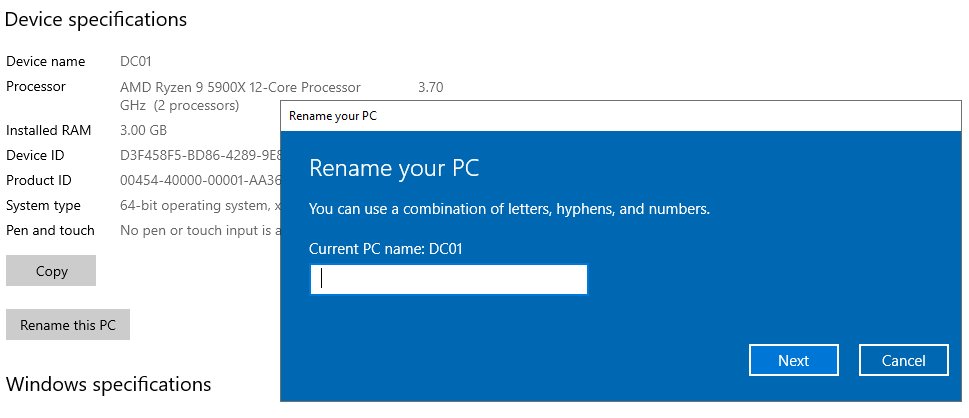
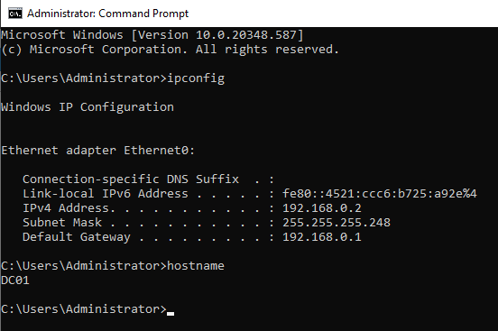
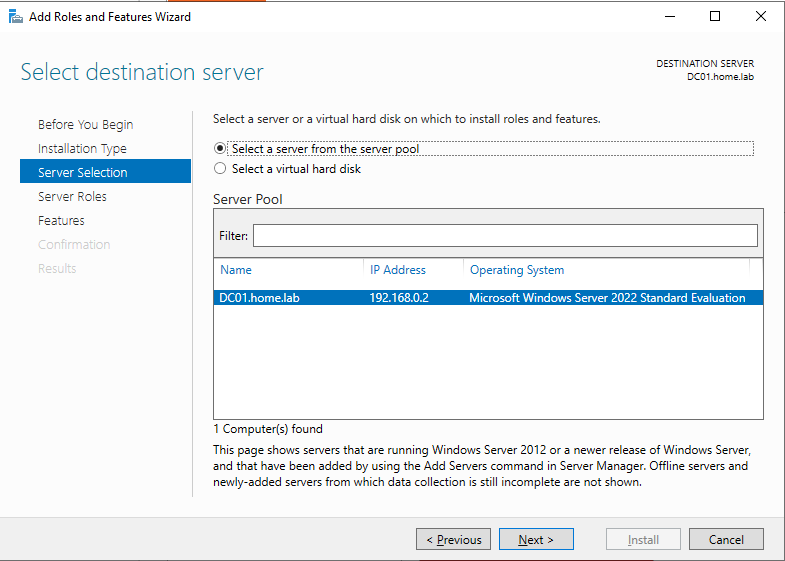
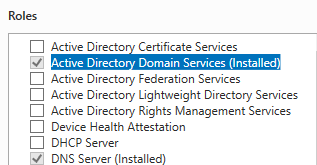
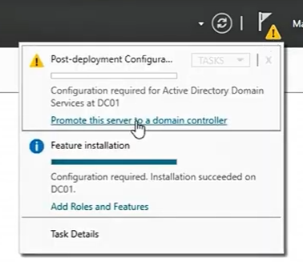
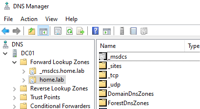
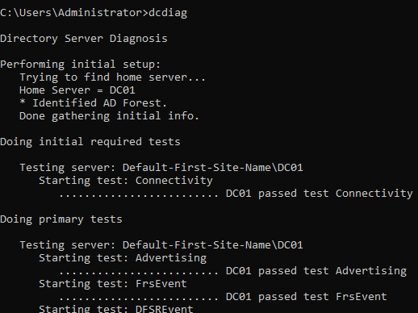

# Setting up AD DC on the Windows Server 

## Intro 
Upon opening the Windows Server VM for the first time, we are presented with the Server Manager GUI. Our goal is to configure this server as an Active Directory Domain Controller (AD DC). However, installing the AD DS role alone does not make the server a domain controller; the server must also be promoted. This is what we will accomplish in this section.

## Purpose
The reasons for turning this server into our AD DC are listed below:
- Runs administrative domain services for any device under its domain
- Acts as a central security authority and database for the network
- Verifies user identities (authentication)
- Grants/denies access to network resources like files and printers (authorization)
As one could imagine, a Windows server acting as an AD DC is essential to any enterprise network.

## Implementation + Results

### Step 1 - Static IP and Renaming Server
Before even promoting the server, two things must be ensured: the server has a static IP address, and the server is renamed. 

If we don't create a static IP address, the server will dynamically obtain its IP address through DHCP. Although a DHCP server may assign the same address repeatedly, the address can change when the lease expires or if the client requests a new lease. Clients and domain services need to reliably locate the domain controller, that is why a predictable IP address is important. 

To ensure the IP address is static, we go to the Control Panel --> Network and Internet --> Network and Sharing Center, and click on th Ethernet adapter. By clicking Properties, we can change the content of the Internet Protocol Version 4. Following our topology, we assign a static IP address of `192.168.0.2` within our `/29` subnet. A `/29` subnet provides 8 total addresses, 6 of which are usable. For now, this is enough to support the number of nodes in our network. The default gateway is `192.168.0.1` which is tied to our pfSense VM that acts as the gateway and firewall. The preferred DNS server is set to the server's own IP address, since this Windows server will also host the DNS service used by Active Directory. Of course, the loopback address `127.0.0.1` could also be used. 

We rename the server because the original name is often vague and not useful for discoverability. To change the name, we do what we do on our everyday Windows computers. We change the PC name on the Windows System settings. I changed the name of the server to something clear and easy to identify, **DC01**. The PC will then need to be restarted before proceeding further. 

Checking that the configurations have been implemented...

### Step 2 - Domain Controller Promotion
Now that we finally have these two core tasks completed, we can promote our server to domain controller. To do this, we first must install the Active Directory Domain Services (AD DS) role. We navigate our Server Manager, and select **Add Roles and Features**. From there we choose **Role-based or feature-based installation** as our installation type. Then, we select our server from our server pool as shown below: 

We then install both the AD DS and DNS server roles. The remaining settings can be left at their defaults.

Finally, we can promote our server to domain controller.

We are then prompted with the deployment configuration. Since we are building this primary domain controller from scratch, we select **Add a new forest**. For the root domain name, to keep it simple, I chose `home.lab`. We are then prompted to choose a Directory Services Restore Mode (DSRM) password, which we can use if we ever need to boot the server into recovery mode. A secure password was chosen accordingly for this step. If all prerequisites are met, the installation should occur successfully. We can check that the domain has been created successfully on our DNS Manager. 

We can also run a health check using the command **dcdiag** on the Command Prompt to ensure everything is working. 

## Conclusion

And that brings us to the end of this section. 

As of now, our server:
- Has had the AD DS and DNS server roles installed
- Has been promoted to a domain controller
- Has created the `home.lab` domain

Next, we tackle our Windows Client VM!

