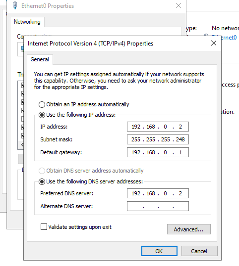

## Setting up AD DC on the Windows Server 

### Intro 
Upon opening the Windows Server VM for the first time, we are taken to GUI for the Server Manager. We need to make this server the AC DC, however, it doesn not become an Active Directory Domain Controller until it is promoted. This is our goal.

### Reason
The reasons for turning this server into our AC DC are listed below:
- Runs administrative domain services for any device under its domain
- Acts as a central security authority and database for the network
- Verifies user identities (authentication)
- Grants/denies access to network resources like files and printers (authorization)
As one could imagine, a Windows server acting as an AC DC is essential to any enterprise network.

### How it was done

#### Static IP and Renaming Server
Before evening promoting the server, two things must be ensured: the server has a static IP address, and the server is renamed. 

If we don't create a static IP address, the server will dynamically receive its IP address from some DHCP server. The issue is that this dynamic IP address can and will change, whether the lease for the current IP address runs out, or the server is restarted. Without a static IP address, clients under this soon-to-be domain controller will not be able to find it, leading to unresponsive clients for users. 

To ensure the IP address is static, we go to the Control Panel --> Network and Internet --> Network and Sharing Center, and click on th Ethernet adapter. By clicking Properties, we can change the content of the Internet Protocol Version 4. Following our topology, we assign a static IP address of 192.168.0.2 in our /29 subnet which allows for 8 addresses. The default gateway is 192.168.0.1 which is tied to our pfSense VM that acts as the gateway, firewall, and Layer 3 switch. The preferred DNS server is set to the servers IP address, since this Windows server is also acting as the DNS server for this network. Please note that the loopback address 127.0.0.1 would also work here. 

We rename the server because the original name is often vague and not useful for dicoverability. To change the name, we do what we do on our everyday Windows computers. We change the PC name on the Windows System settings. I changed the name of server to something clear and easy to identify, **DC01**. The PC will then need to be restarted before proceeding further. 

Now that we finally have these two core tasks completed, we can promote our server to domain controller. To do this, we first must download Active Directory Domain Services. We navigate our Server Manager, and select **Add Roles and Features**. From there we choose **Role-based or feature-based installation** as our installation type. Then, we select our server from our server pool as shown below: 

Then, we choose to make the server the AD DS as well as the DNS server. The rest of the settings can be left as default.

Finally, we can promote our server to Domain Controller.

