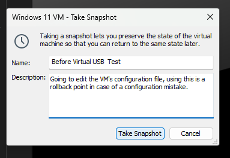
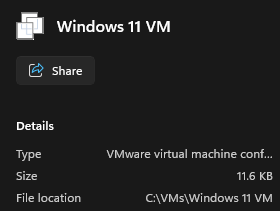
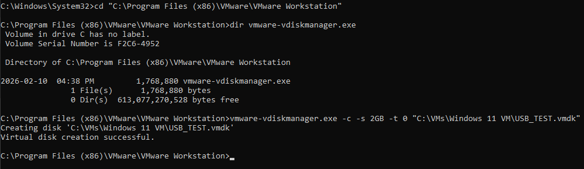
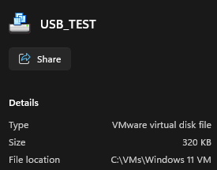
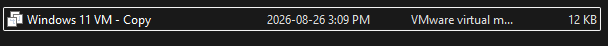
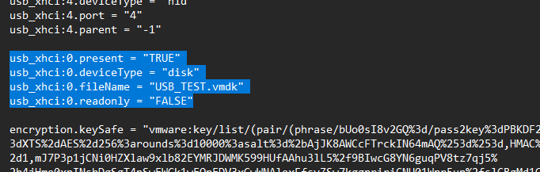
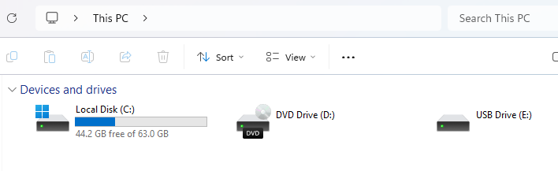
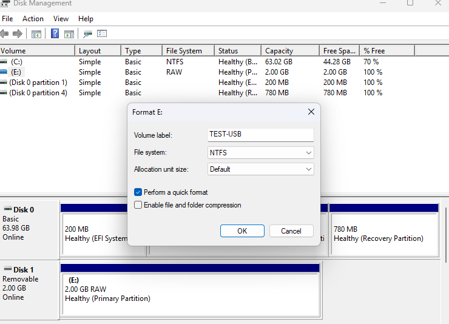
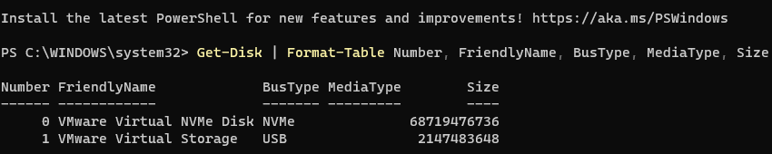

## Creating the Windows 11 Client VM 

### VM creation 

For this client VM, the following virtual hardware specifications were sufficient for the lab:
- **Memory:** 3GB
- **Processors:** 2
- **Hard Disk (NVMe):** 64GB

For the CD/DVD drive:
- Downloaded the Windows 11 ISO file (Version 25H2) from the [official Microsoft website](https://www.microsoft.com/en-in/software-download/windows11)
- Mounted the ISO to the VM's CD/DVD drive (SATA)

For the network adapter...
- Attached the VM to the same host-only network as the other VMs in the virtual LAN

 

### Creating a Virtual USB on Windows 11 VM 

A virtual USB storage device was created to provide a controlled and disposable test medium for the [REMOVABLE-STORAGE-RESTRICTION GPO](https://github.com/haneen-al/cybersecurity-home-lab/blob/main/01-windows-server/1.4-gpos.md#gpo-3---removable-storage-restriction-policy).

>[!WARNING]
>This virtual USB setup uses a custom VMware .vmx configuration rather than a standard VMware Workstation feature. Directly modifying VMX files can cause VM configuration or startup issues if configured incorrectly. Create a VM snapshot and back up the original .vmx file before making changes so the configuration can be restored if necessary.

#### To do this, the following process was followed:

The first step was to shut down the Windows 11 client, since this is the VM's .vmx file I will alter. I then took a snapshot of the VM which gives me an easy rollback point in case of a configuration mistake. 

Finding my Windows 11 VM directory, I can locate the .vmx file. I do not change anything on it yet.

We first want to create a disposable VMDK. The VMDK is the virtual storage device. We open an Admin CMD session on our host PC and navigate to VMWware's installation directory. This is commonly found using `cd "C:\Program Files (x86)\VMware\VMware Workstation"`. From there we check for the virtual disk manager using the command `dir vmware-vdiskmanager.exe`. This .exe file is VMware's command-line tool for creating and managing virtual disk files (such as .vmdk files). 

Now that we have checked it is within this folder, we use the command `vmware-vdiskmanager.exe -c -s 2GB -t 0 "C:\VMs\Windows 11 VM\USB_TEST.vmdk"`.

Let's break this command down: 
- `-c` creates a new virtual disk
- `-s 2GB` makes the maximum size of the disk 2GB
- `-t 0` creates a dynamically expanding virtual disk that can grow up to the specified maximum size
- `C:\VMs\Windows 11 VM\USB_TEST.vmdk` specifies where the new VMDK file will be created (I put it in the same folder as my Windows 11 .vmx file) and also what the name of the VMDK file will be (I chose `USB_TEST.vmdk`)

Now we have our empty VMDK file.

Before continuing, create a copy of the .vmx file we will be altering in case of a configuration mistake. Do not open or touch this copy as it is our backup of our original and soon-to-be altered .vmx file. 

Open the original .vmx file in a text editor of your choice. Add the following lines anywhere in the .vmx file. For simplicity's sake, I added mine to the bottom. 

**usb_xhci:0.present = "TRUE"**  
**usb_xhci:0.deviceType = "disk"**  
**usb_xhci:0.fileName = "USB_TEST.vmdk"**  
**usb_xhci:0.readonly = "FALSE"**  

Please note that for the third line, the vmdk file name should be your own, as `USB_TEST` was the name I created earlier.

Here is what each line actually means going in relative order to the code:
1. Tells VMware to create USB device 0 on the VM's xHCI USB controller.
2. Tells VMware to attach the VMDK as a disk device through the VM's xHCI USB controller.
3. Tells VMware that the backing storage for USB device 0 is this VMDK file.
4. Means that Windows is allowed to write to the virtual USB disk.

We can then save the .vmx file and then power up our VM again. Once logged in, press `Win + R` and enter `diskmgmt.msc`. We are then shown our virtual USB disk if configurations were successful.

In order to utilize this disk, we will first need to format it. Right click the correct partition and select format. For file system, select NTFS (New Technology File System) which is the main file system Windows uses to organize and store files on a disk. 

We then can see our now formatted USB drive.

We then test out our configurations by creating a text file within our virtual USB disk. I created test.txt and have successfully written to it.

For one more layer of verification. We can open up Powershell and use the command `Get-Disk | Format-Table Number, FriendlyName, BusType, MediaType, Size`. 

Here, Windows identifies the resulting storage device as BusType: USB, providing a controlled virtual USB storage device for testing the removable-storage GPO.

If you came from the GPO section, [Click Here To Go Back](https://github.com/haneen-al/cybersecurity-home-lab/blob/main/01-windows-server/1.4-gpos.md#gpo-3---removable-storage-restriction-policy).

#### Resources

*Please note that the following sources were used as references while researching this configuration. The procedure relies on a custom VMware VMX configuration and is not presented as an officially supported VMware Workstation feature. Community sources were cross-referenced where possible.*

[Broadcom VMware Community — Virtualizing a physical USB drive](https://community.broadcom.com/vmware-cloud-foundation/discussion/virtualizing-a-physical-usb-boot-drive)  
[NTLite Community — Create a bootable virtual USB drive inside VMware](https://ntlite.com/community/threads/create-a-bootable-virtual-usb-drive-inside-vmware.4150)  
[Online Computer Tips — Create a Virtual USB Drive in VMware Workstation](https://onlinecomputertips.com/support-categories/software/vmware-workstation-virtual-usb)  
[Reddit — Using VMDK as a virtual USB drive in Workstation](https://www.reddit.com/r/vmware/comments/1ek2t0o/using_vmdk_as_a_virtual_usb_drive_in_workstation)  

