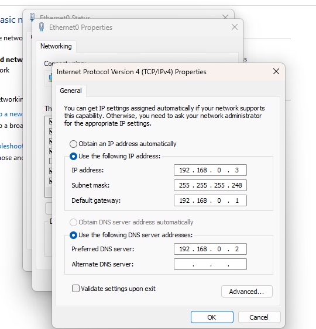
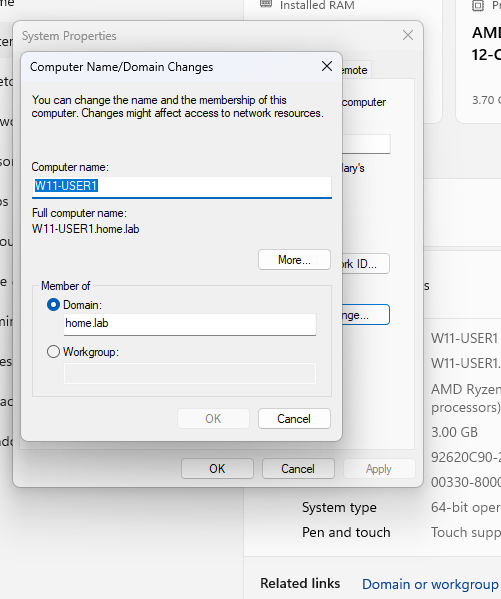
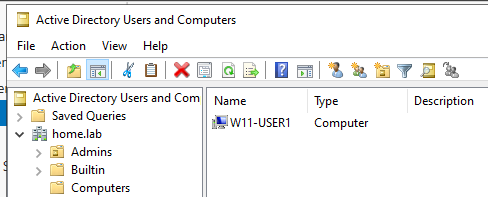
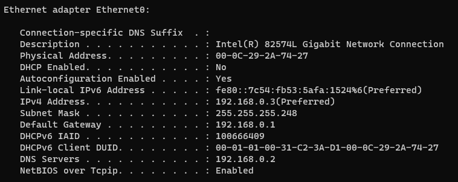
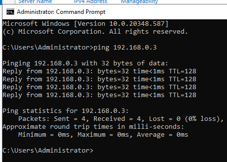

# Joining our Windows 11 Client to our `home.lab` Domain 

## Intro 
Now we have a domain, but what good is it if there are no clients connected to it? In this section, we will join our Windows client to our `home.lab` domain.

## Purpose
Joining the Windows 11 clienty to the `home.lab` domain allows it to become part of the centralized Active Directory (AD) environment. This allows the client to:
- Authenticate users against the centralized AD domain
- Receive and enforce centralized security policies through Group Policy
- Access domain resources based on user permissions
- Be centrally managed by domain administrators
- Communicate with other domain-joined systems using services provided by the domain controller
This way, we can manage the workstation through the same centralized security and administrative infrastructure used for the entire network.

## Implementation + Results

### Step 1 - Assigning IP Addresses
We first must make sure that our client is within the same network segment as our server. Following our topology and addressing scheme, we assign an IP address from our `192.168.0.0/29` subnet. I configured this Windows client with and IP address of `192.168.0.3`. Our gateway will be configured as `192.168.0.1`, same as the Windows server. For our DNS server, we configure our client to get all DNS resolutions and services from our Windows server, using the IP address `192.168.0.2`. 

We can verify this configuration using the command `ipconfig /all` on the command prompt. 

### Step 2 - Joining the Windows Client to the `home.lab` Domain 

To do this, we simply go to the Windows settings on our Windows client. Then we go to Systems --> About --> Device Specifications --> Domain or Workgroup. From there we give the computer an identifiable name, and input our domain name `home.lab` beside the domain selection. 

We can verify that the client has joined the domain successfully from our server. By navigating to **Active Directory Users and Computers**, we can see our client added to the domain. 

Finally, none of this really matters if we don't have connectivity between our server and client. Nothing a few pings and an `nslookup` can't check...

From the client... 

From the server... 

Success! 

### Conclusion 

Now that we have successfully joined our Windows 11 client to our `home.lab` domain, we can move on to creating shared password policies and GPOs for security and accessibility.

